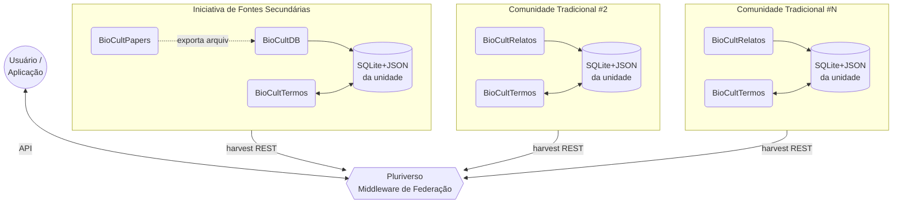

# Pluriverso

Middleware de federação para o ecossistema de Conhecimento Tradicional Associado à Biodiversidade (CTA).

[](https://github.com/edalcin/pluriverso)

---

## O que é o Pluriverso?

O **Pluriverso** é o middleware de federação da [Arquitetura BioCultural](https://github.com/edalcin/Arquitetura-BioCultural). Ele permite que iniciativas e comunidades tradicionais completamente independentes — cada uma com sua própria infraestrutura soberana de dados — sejam acessíveis de forma integrada por pesquisadores e aplicações.

O nome reflete o conceito filosófico e político do "pluriverso": não um universo único e centralizado, mas a coexistência de múltiplos mundos autônomos que se relacionam sem se subordinar.

> "Se os dados não estão fisicamente sob o controle de quem os gerou, a soberania é apenas uma promessa bonita em um termo de consentimento."
>
> — Eduardo Dalcin, em [*Sementes Livres, Solos Próprios: Por que o Conhecimento Tradicional exige uma Arquitetura Federada*](https://eduardo.dalc.in/por-que-o-conhecimento-tradicional-exige-uma-arquitetura-federada/), post que resume e ilustra didaticamente a arquitetura federada da qual o Pluriverso é o middleware de federação.

---

## Posição na Arquitetura Federada



Cada membro da federação (iniciativa ou comunidade) opera de forma completamente independente e soberana. O Pluriverso **não** gerencia os dados dos membros — ele indexa apenas o que cada membro decide tornar público.

---

## Responsabilidades

### 1. Harvest Periódico

Coleta registros públicos de cada membro via endpoint REST paginado. Cada membro expõe:

```
GET /api/federation/records?page=1&size=100&updated_since=<ISO>
```

O Pluriverso agenda coletas periódicas, mantém um índice central dos registros `visibility: public`, e detecta remoções (registro sumiu do endpoint → remove do índice).

### 2. Índice Central

Armazena e indexa os registros coletados para busca eficiente, implementado em **SQLite+JSON (JSON1) + FTS5** para busca textual. O índice é uma **cópia derivada** dos dados públicos dos membros — a fonte de verdade permanece sempre no membro.

### 3. Camada de Mapeamento Semântico

Mantém mapeamentos SKOS entre os vocabulários (BioCultTermos) dos diferentes membros:

- `skos:exactMatch` — conceitos idênticos em membros diferentes
- `skos:closeMatch` — conceitos muito similares
- `skos:broadMatch` / `skos:narrowMatch` — conceitos em relação hierárquica

Esses mapeamentos permitem que uma busca por "mandioca" retorne resultados de membros que usam "cassava", "Manihot esculenta", "macaxeira" ou termos em línguas indígenas — desde que o curador da federação tenha mapeado os conceitos.

### 4. API Pública Unificada

Expõe uma API única para usuários e aplicações acessarem o conjunto federado de CTAs, com:

- Busca textual e semântica (via mapeamentos SKOS)
- Filtros por membro, tipo de fonte, comunidade, espécie, região
- Atribuição clara da origem de cada registro (member_id)
- Respeito às licenças e restrições definidas por cada membro

### 5. Interface de Governança

Suporta o **Comitê Federado** — composto por representantes de cada membro — nas decisões sobre:

- Admissão e remoção de membros
- Contrato de publicação (campos obrigatórios do endpoint)
- Aprovação de mapeamentos semânticos
- Resolução de conflitos

---

## Princípios de Design

### Soberania dos Membros

O Pluriverso **nunca** acessa dados de um membro além do que o membro publica explicitamente. Não há backdoor, não há acesso direto ao banco (SQLite) de ninguém.

### Remoção Imediata

Quando um membro sai da federação, todos os seus dados são removidos do índice central imediatamente (`purge_by_member`). Mapeamentos SKOS envolvendo seus conceitos também são removidos. O processo é auditável.

### Transparência de Origem

Cada registro no índice carrega `member_id` permanente. O Pluriverso nunca "apaga" a procedência de um dado.

### CARE na Prática

| Princípio | Implementação no Pluriverso |
|-----------|---------------------------|
| **Collective Benefit** | Acesso integrado beneficia pesquisadores e comunidades de todos os membros |
| **Authority to Control** | Membro decide o que publica; pode sair e remover tudo a qualquer momento |
| **Responsibility** | Auditoria de harvest; logs de remoção; mapeamentos semânticos revisados pelo comitê |
| **Ethics** | Atribuição de origem obrigatória; respeito a licenças por membro |

---

## Necessidades de Implementação (v3.1)

O Pluriverso é um **novo componente**, ainda sem implementação. As principais funcionalidades a desenvolver:

- [ ] Harvest scheduler: coleta periódica configurável por membro
- [ ] Parser do endpoint de harvest: consumir e normalizar respostas dos membros
- [ ] Índice central: armazenamento (SQLite+JSON) e busca (FTS5) dos registros coletados
- [ ] Camada de mapeamento SKOS: CRUD de mapeamentos entre ConceptSchemes
- [ ] Motor de busca semântica: busca expandida por mapeamentos SKOS
- [ ] API pública REST: endpoint de consulta federada
- [ ] `purge_by_member`: remoção completa de um membro do índice
- [ ] Interface de governança: painel para o Comitê Federado

---

## Relação com os Demais Componentes

| Componente | Relação com o Pluriverso |
|------------|--------------------------|
| **[BioCultDB](https://github.com/edalcin/BioCultDB)** | Membro da federação; expõe endpoint de harvest com registros secundários aprovados |
| **[BioCultPapers](https://github.com/edalcin/BioCultPapers)** | Alimenta o BioCultDB; sem relação direta com o Pluriverso |
| **[BioCultRelatos](https://github.com/edalcin/BioCultRelatos)** | Membro da federação (por comunidade); expõe endpoint de harvest com registros primários consentidos |
| **[BioCultTermos](https://github.com/edalcin/BioCultTermos)** | Cada instância é soberana; Pluriverso mantém mapeamentos entre instâncias de diferentes membros |
| **[Arquitetura BioCultural](https://github.com/edalcin/Arquitetura-BioCultural)** | Repositório de arquitetura; documenta o Pluriverso e a federação como um todo |

---

## Documentação da Arquitetura

A arquitetura completa, incluindo diagramas C4, ADRs e decisões de design, está documentada em:

**[Arquitetura BioCultural](https://github.com/edalcin/Arquitetura-BioCultural)** — especialmente:
- [ADR-004: Arquitetura Federada v3.0](https://github.com/edalcin/Arquitetura-BioCultural/blob/main/docs/architecture-decisions/ADR-004-federated-architecture.md)

---

## Licença

A definir — considerando licenças que respeitem os princípios C.A.R.E. e protejam adequadamente o conhecimento tradicional.

## Contato

[GitHub Issues](https://github.com/edalcin/pluriverso/issues)

---

## Agradecimentos

A formulação desta proposta técnica e a consolidação de sua visão ética e conceitual não seriam possíveis sem os diálogos, provocações e insights preciosos de parceiros fundamentais. Registro meu profundo agradecimento à Viviane Fonseca, do Jardim Botânico do Rio de Janeiro (JBRJ); ao Lucas Zelesco, da Fundação Nacional dos Povos Indígenas (FUNAI); e aos membros do Comitê Gestor Useflora, cuja dedicação à salvaguarda da sociobiodiversidade e ao respeito às comunidades tradicionais inspirou cada linha de código e de arquitetura deste projeto.
