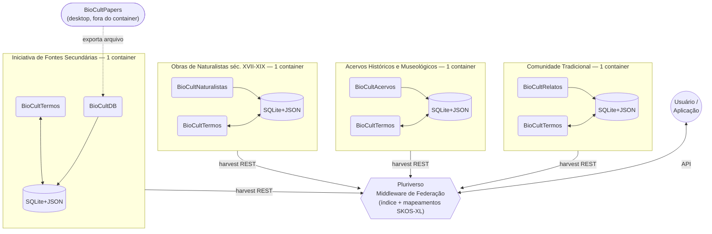

# Pluriverso

Middleware de federação para o ecossistema de Conhecimento Tradicional Associado à Biodiversidade (CTA).

[](https://github.com/edalcin/pluriverso)

> **Status**: Documentação de implementação completa — stack e framework, API pública REST, contrato de harvest, modelo de dados SQLite, autenticação e segurança do Comitê, busca semântica SKOS, arquitetura C4 e roadmap de 7 fases já especificados (ver `docs/`) — ainda sem código.

---

## O que é o Pluriverso?

O **Pluriverso** é o middleware de federação da [Arquitetura BioCultural](https://github.com/edalcin/Arquitetura-BioCultural). Ele permite que iniciativas, comunidades tradicionais, acervos históricos/museológicos e registros de obras de naturalistas — cada um com sua própria infraestrutura soberana de dados e de vocabulário (BioCultTermos) — sejam acessíveis de forma integrada por pesquisadores e aplicações.

O nome reflete o conceito filosófico e político do "pluriverso": não um universo único e centralizado, mas a coexistência de múltiplos mundos autônomos que se relacionam sem se subordinar.

> "Se os dados não estão fisicamente sob o controle de quem os gerou, a soberania é apenas uma promessa bonita em um termo de consentimento."
>
> — Eduardo Dalcin, em [*Sementes Livres, Solos Próprios: Por que o Conhecimento Tradicional exige uma Arquitetura Federada*](https://eduardo.dalc.in/por-que-o-conhecimento-tradicional-exige-uma-arquitetura-federada/), post que resume e ilustra didaticamente a arquitetura federada da qual o Pluriverso é o middleware de federação.

---

## Posição na Arquitetura Federada


```mermaid
graph TD
    I1P(["BioCultPapers\n(desktop, fora do container)"])

    subgraph I1["Iniciativa de Fontes Secundárias — 1 container"]
        I1A(BioCultDB) --> I1S[(SQLite+JSON)]
        I1C(BioCultTermos) <--> I1S
    end

    I1P -.->|"exporta arquivo"| I1A

    subgraph C2["Comunidade Tradicional — 1 container"]
        C2A(BioCultRelatos) --> C2S[(SQLite+JSON)]
        C2B(BioCultTermos) <--> C2S
    end

    subgraph AC["Acervos Históricos e Museológicos — 1 container"]
        ACA(BioCultAcervos) --> ACS[(SQLite+JSON)]
        ACB(BioCultTermos) <--> ACS
    end

    subgraph NA["Obras de Naturalistas séc. XVII-XIX — 1 container"]
        NAA(BioCultNaturalistas) --> NAS[(SQLite+JSON)]
        NAB(BioCultTermos) <--> NAS
    end

    PL{{"Pluriverso\nMiddleware de Federação\n(índice + mapeamentos SKOS-XL)"}}
    U((Usuário /\nAplicação))

    I1 -->|harvest REST| PL
    C2 -->|harvest REST| PL
    AC -->|harvest REST| PL
    NA -->|harvest REST| PL
    U <-->|API| PL
```

Cada membro da federação (iniciativa ou comunidade) opera de forma completamente independente e soberana. O Pluriverso **não** gerencia os dados dos membros — ele indexa apenas o que cada membro decide tornar público.

---

## Responsabilidades

### 1. Harvest Periódico

Coleta registros públicos de cada membro via endpoint REST paginado. Cada membro expõe:

```
GET /api/federation/records?page=1&size=100&updated_since=<ISO>
```

O Pluriverso agenda coletas periódicas, mantém um índice central dos registros `visibility: public`, e detecta remoções (registro sumiu do endpoint → remove do índice).

### 2. Índice Central

Armazena e indexa os registros coletados para busca eficiente, implementado em **SQLite embutida via
`better-sqlite3`** (JSON1 + FTS5), com arquivo único externo ao container via `SQLITE_DB_PATH` (default
`/data/pluriverso.sqlite`), em modo WAL, no mesmo container da aplicação. O índice é uma **cópia derivada**
dos dados públicos dos membros — a fonte de verdade permanece sempre no membro. Detalhes em
[ADR-008](https://github.com/edalcin/Arquitetura-BioCultural/blob/main/docs/tecnico/architecture-decisions/ADR-008-pluriverso-database-engine.md).

### 3. Camada de Mapeamento Semântico

Cada instância federada embute sua própria camada semântica — uma instância soberana do BioCultTermos, no mesmo container e arquivo SQLite do membro. O Pluriverso não hospeda nenhum vocabulário: ele **unifica** essas camadas semânticas independentes mantendo mapeamentos SKOS-XL (`skos:exactMatch`, `skos:closeMatch`, `skos:broadMatch`) entre os `ConceptScheme` de membros diferentes, aprovados pelo Comitê Federado e nunca impostos.

Mantém mapeamentos SKOS entre os vocabulários (BioCultTermos) dos diferentes membros:

- `skos:exactMatch` — conceitos idênticos em membros diferentes
- `skos:closeMatch` — conceitos muito similares
- `skos:broadMatch` / `skos:narrowMatch` — conceitos em relação hierárquica

Esses mapeamentos permitem que uma busca por "mandioca" retorne resultados de membros que usam "cassava", "Manihot esculenta", "macaxeira" ou termos em línguas indígenas — desde que o curador da federação tenha mapeado os conceitos.

### 4. API Pública Unificada

Expõe uma API única para usuários e aplicações acessarem o conjunto federado de CTAs, com:

- Busca textual e semântica (via mapeamentos SKOS)
- Filtros por membro, tipo de fonte, comunidade, espécie, região
- Atribuição clara da origem de cada registro (member_id)
- Respeito às licenças e restrições definidas por cada membro

### 5. Interface de Governança

Suporta o **Comitê Federado** — composto por representantes de cada membro — nas decisões sobre:

- Admissão e remoção de membros
- Contrato de publicação (campos obrigatórios do endpoint)
- Aprovação de mapeamentos semânticos
- Resolução de conflitos

#### Fluxo de Inscrição

Uma instância que já opera BioCultDB, BioCultRelatos, BioCultAcervos ou BioCultNaturalistas solicita entrada na federação pela própria interface pública do Pluriverso — sem precisar de Git ou acesso a repositório algum:

1. **Cadastro self-service**: o solicitante informa nome, tipo de membro, a **URL-BASE** de sua instância, contato e uma declaração de conformidade C.A.R.E. (`POST /api/federation/membership-requests`) — o pedido nasce `pending`.
2. **Verificação técnica automática**: o Pluriverso testa `{URL-BASE}/api/federation/records` contra o contrato de harvest (HTTPS obrigatório, bloqueio de IPs privados/loopback). O resultado é anexado ao pedido como sinal para o Comitê — nunca aprova ou rejeita sozinho.
3. **Fila de aprovação do Comitê Federado**: só uma decisão humana move o pedido para `active` (entra no agendador de harvest) ou `rejected` (motivo registrado; solicitante pode reenviar).

Admissão nunca é automática — a verificação técnica é apoio à decisão, não substituto dela. Detalhes completos (modelo de dados, estados, mitigação de SSRF) em [ADR-006](https://github.com/edalcin/Arquitetura-BioCultural/blob/main/docs/tecnico/architecture-decisions/ADR-006-federation-membership-protocol.md).

### Múltiplas Instâncias

O Pluriverso é **instanciável**, não singleton: uma associação de comunidades tradicionais que opera vários
`BioCultRelatos` pode rodar sua própria instância do Pluriverso, federando apenas os dados das suas
comunidades, sem depender do Pluriverso público global. Pontos-chave:

- Cada instância = 1 container + 1 arquivo SQLite próprio (ADR-008)
- Membership e `member_id` escopados por instância — sem registro global de identidade entre instâncias
- Um mesmo membro pode ser coletado por múltiplas instâncias simultaneamente (harvest é só leitura pública)
- Sem hierarquia entre instâncias — cada uma tem seu próprio Comitê Federado
- Harvest coleta apenas `visibility: public` hoje; harvest autenticado para `restricted` é extensão futura

Detalhes completos em [ADR-009](https://github.com/edalcin/Arquitetura-BioCultural/blob/main/docs/tecnico/architecture-decisions/ADR-009-pluriverso-multi-instance-topology.md).

---

## Princípios de Design

### Soberania dos Membros

O Pluriverso **nunca** acessa dados de um membro além do que o membro publica explicitamente. Não há backdoor, não há acesso direto ao banco (SQLite) de ninguém.

### Remoção Imediata

Quando um membro sai da federação, todos os seus dados são removidos do índice central imediatamente (`purge_by_member`). Mapeamentos SKOS envolvendo seus conceitos também são removidos. O processo é auditável.

### Transparência de Origem

Cada registro no índice carrega `member_id` permanente. O Pluriverso nunca "apaga" a procedência de um dado.

### CARE na Prática

| Princípio | Implementação no Pluriverso |
|-----------|---------------------------|
| **Collective Benefit** | Acesso integrado beneficia pesquisadores e comunidades de todos os membros |
| **Authority to Control** | Membro decide o que publica; pode sair e remover tudo a qualquer momento |
| **Responsibility** | Auditoria de harvest; logs de remoção; mapeamentos semânticos revisados pelo comitê |
| **Ethics** | Atribuição de origem obrigatória; respeito a licenças por membro |

---

## Necessidades de Implementação (v3.3)

O Pluriverso é um **novo componente**; o planejamento completo de sua implementação já foi realizado — arquitetura C4, contratos de API e de harvest, modelo de dados e roadmap de 7 fases estão documentados (links abaixo). As principais funcionalidades a implementar:

- [ ] [`docs/contrato-harvest.md` §2](docs/contrato-harvest.md#2--modos-de-coleta-e-detecção-de-remoção) (Modos de coleta) / [`HarvestScheduler`](docs/arquitetura.md) — Harvest scheduler: coleta periódica configurável por membro
- [ ] [`docs/contrato-harvest.md` §1](docs/contrato-harvest.md#1--contrato-de-registros-cliente) (Comportamento do coletor) — Parser do endpoint de harvest: consumir e normalizar respostas dos membros
- [ ] [`docs/modelo-de-dados.md`](docs/modelo-de-dados.md) (`records`, `records_fts`) — Índice central: armazenamento (SQLite+JSON) e busca (FTS5) dos registros coletados
- [ ] [`docs/modelo-de-dados.md`](docs/modelo-de-dados.md) (`concept_mappings`) / [`docs/api.md`](docs/api.md) (`/api/v1/mappings`) — Camada de mapeamento SKOS: CRUD de mapeamentos entre ConceptSchemes
- [ ] [`docs/busca-semantica.md`](docs/busca-semantica.md) — Motor de busca semântica: busca expandida por mapeamentos SKOS
- [ ] [`docs/api.md` §5.1](docs/api.md#51--pública-sem-autenticação) — API pública REST: endpoint de consulta federada
- [ ] [`docs/modelo-de-dados.md`](docs/modelo-de-dados.md#purge_by_membermember_id) — `purge_by_member`: remoção completa de um membro do índice
- [ ] [`docs/governanca-e-seguranca.md`](docs/governanca-e-seguranca.md) (Painel do Comitê Federado) — Interface de governança: painel para o Comitê Federado
- [ ] [`docs/api.md`](docs/api.md) (`POST /api/federation/membership-requests`) — Endpoint `POST /api/federation/membership-requests`: cadastro self-service de novos membros
- [ ] [`docs/governanca-e-seguranca.md`](docs/governanca-e-seguranca.md) (Probe Anti-SSRF) — Probe de verificação técnica (anti-SSRF) sobre a URL-BASE informada no cadastro
- [ ] [`docs/api.md` §5.2](docs/api.md#52--comitê-federado-autenticada) — Fila de aprovação (`GET`/`PATCH /api/federation/membership-requests`) para o Comitê Federado decidir

Fechamento da documentação: arquitetura completa (C4) em [`docs/arquitetura.md`](docs/arquitetura.md), fases de implementação em [`docs/roadmap.md`](docs/roadmap.md), e deploy, variáveis de ambiente e Docker em [`docs/operacao.md`](docs/operacao.md).

---

## Relação com os Demais Componentes

| Componente | Relação com o Pluriverso |
|------------|--------------------------|
| **[BioCultDB](https://github.com/edalcin/BioCultDB)** | Membro da federação; expõe endpoint de harvest com registros secundários aprovados |
| **[BioCultPapers](https://github.com/edalcin/BioCultPapers)** | Alimenta o BioCultDB; sem relação direta com o Pluriverso |
| **[BioCultRelatos](https://github.com/edalcin/BioCultRelatos)** | Membro da federação (por comunidade); expõe endpoint de harvest com registros primários consentidos |
| **[BioCultTermos](https://github.com/edalcin/BioCultTermos)** | Cada instância é soberana; Pluriverso mantém mapeamentos entre instâncias de diferentes membros |
| **[BioCultAcervos](https://github.com/edalcin/BioCultAcervos)** | Membro da federação (Acervos Históricos e Museológicos); embute sua própria instância soberana do BioCultTermos e expõe endpoint de harvest — projeto em fase inicial |
| **[BioCultNaturalistas](https://github.com/edalcin/BioCultNaturalistas)** | Membro da federação (Obras de Naturalistas séc. XVII–XIX); embute sua própria instância soberana do BioCultTermos e expõe endpoint de harvest — projeto em fase inicial |
| **[Arquitetura BioCultural](https://github.com/edalcin/Arquitetura-BioCultural)** | Repositório de arquitetura; documenta o Pluriverso e a federação como um todo |

---

## Documentação da Arquitetura

A arquitetura completa, incluindo diagramas C4, ADRs e decisões de design, está documentada em:

**[Arquitetura BioCultural](https://github.com/edalcin/Arquitetura-BioCultural)** (v3.3) — especialmente:
- [ADR-004: Arquitetura Federada v3.0](https://github.com/edalcin/Arquitetura-BioCultural/blob/main/docs/tecnico/architecture-decisions/ADR-004-federated-architecture.md)
- [ADR-005: Persistência SQLite com JSON](https://github.com/edalcin/Arquitetura-BioCultural/blob/main/docs/tecnico/architecture-decisions/ADR-005-sqlite-json-persistence.md)
- [ADR-006: Protocolo de Inscrição na Federação](https://github.com/edalcin/Arquitetura-BioCultural/blob/main/docs/tecnico/architecture-decisions/ADR-006-federation-membership-protocol.md)
- [ADR-008: Engine de Banco de Dados do Pluriverso](https://github.com/edalcin/Arquitetura-BioCultural/blob/main/docs/tecnico/architecture-decisions/ADR-008-pluriverso-database-engine.md)
- [ADR-009: Topologia Multi-Instância do Pluriverso](https://github.com/edalcin/Arquitetura-BioCultural/blob/main/docs/tecnico/architecture-decisions/ADR-009-pluriverso-multi-instance-topology.md)

---

## Licença

A definir — considerando licenças que respeitem os princípios C.A.R.E. e protejam adequadamente o conhecimento tradicional.

## Contato

[GitHub Issues](https://github.com/edalcin/pluriverso/issues)

---

## Agradecimentos

A formulação desta proposta técnica e a consolidação de sua visão ética e conceitual não seriam possíveis sem os diálogos, provocações e insights preciosos de parceiros fundamentais. Registro meu profundo agradecimento à Viviane Fonseca, do Jardim Botânico do Rio de Janeiro (JBRJ); ao Lucas Zelesco, da Fundação Nacional dos Povos Indígenas (FUNAI); e aos membros do Comitê Gestor Useflora, cuja dedicação à salvaguarda da sociobiodiversidade e ao respeito às comunidades tradicionais inspirou cada linha de código e de arquitetura deste projeto.
