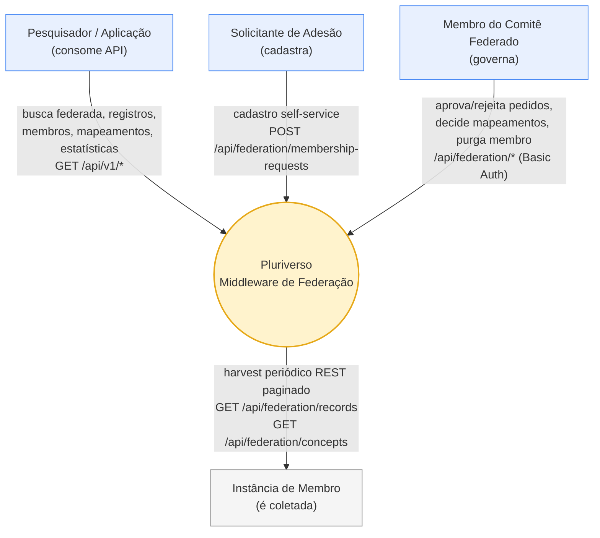
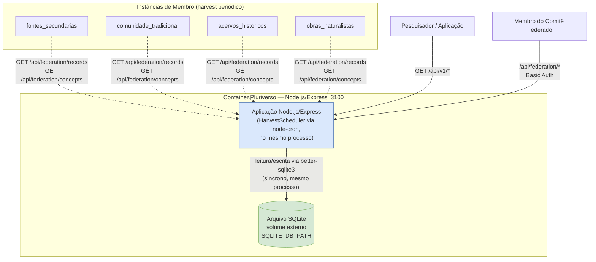
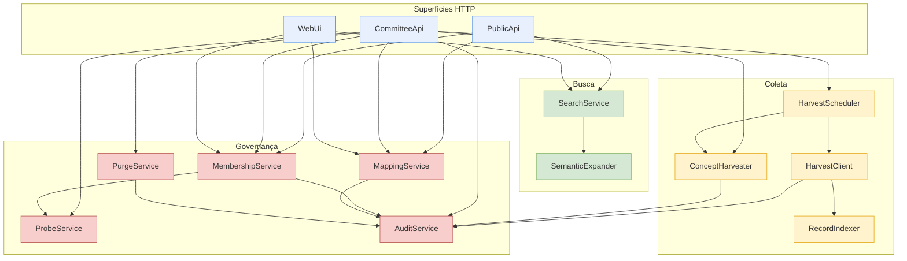

# Arquitetura do Pluriverso (C4)

Este documento descreve a arquitetura do Pluriverso nos três primeiros níveis do [C4 Model](https://c4model.com/) — Contexto, Contêiner e Componente. Segue a estrutura de heading usada em [`Arquitetura-BioCultural/docs/tecnico/c4-model`](https://github.com/edalcin/Arquitetura-BioCultural/tree/main/docs/tecnico/c4-model), adaptada para os três níveis num único documento.

O Pluriverso é o middleware de federação descrito em [ADR-004/D1-D6](https://github.com/edalcin/Arquitetura-BioCultural/blob/main/docs/tecnico/architecture-decisions/ADR-004-federated-architecture.md): coleta periodicamente registros e conceitos de instâncias membro via REST, indexa localmente, expande buscas por mapeamento semântico SKOS aprovado pelo Comitê Federado, e serve uma API pública e uma UI de busca. Não existiam nomes de componente pré-existentes no C4 Model central para reusar (nenhuma menção a "Pluriverso" em nenhum dos três arquivos daquele repositório) — os nomes fixados no Nível 3 deste documento são, portanto, canônicos: toda a documentação subsequente do Pluriverso e o código que vier a implementá-lo devem usá-los verbatim, sem variação.

---

## Nível 1: Diagrama de Contexto

### Visão Geral

O Pluriverso relaciona-se com quatro atores e **nenhum sistema externo obrigatório**. Isso contrasta deliberadamente com o sistema central da Arquitetura-BioCultural, que integra GBIF, Flora e Funga do Brasil e Fauna do Brasil para validação taxonômica ([`01-context-diagram.md`](https://github.com/edalcin/Arquitetura-BioCultural/blob/main/docs/tecnico/c4-model/01-context-diagram.md), seção "Sistemas Externos").

**O Pluriverso não chama GBIF, Flora e Funga do Brasil, Fauna do Brasil, nem qualquer outra base taxonômica externa.** A validação taxonômica é responsabilidade exclusiva de cada instância membro, antes de o registro ser exposto no endpoint de harvest — o Pluriverso apenas coleta, indexa e reexpõe `data` como o membro o publicou ([ADR-004/D2](https://github.com/edalcin/Arquitetura-BioCultural/blob/main/docs/tecnico/architecture-decisions/ADR-004-federated-architecture.md), "camada de mapeamento semântico no Pluriverso" — mapeamento entre conceitos publicados, nunca verificação de nomenclatura contra uma autoridade taxonômica). Impor uma segunda validação taxonômica no Pluriverso duplicaria uma responsabilidade que já é do membro soberano e contradiria a governança distribuída de [ADR-004/D3](https://github.com/edalcin/Arquitetura-BioCultural/blob/main/docs/tecnico/architecture-decisions/ADR-004-federated-architecture.md).

Pela mesma razão de soberania, o Pluriverso **não embute o BioCultTermos como submodule**. [ADR-007/F1-F2](https://github.com/edalcin/Arquitetura-BioCultural/blob/main/docs/tecnico/architecture-decisions/ADR-007-shared-bioculttermos-module.md) reserva o submodule BioCultTermos às unidades membro que produzem conteúdo primário; o Pluriverso apenas **coleta** os `ConceptScheme` que cada membro publica (Nível 1 §3.5 do contrato de harvest), sem instanciar sua própria cópia do módulo terminológico.

### Diagrama

Nenhum sistema externo aparece no diagrama — não há caixa de GBIF, Flora e Funga do Brasil ou qualquer base de terceiros, porque não existe integração obrigatória. Se uma futura versão vier a introduzir uma integração externa opcional, ela deve ser adicionada aqui como uma caixa separada, nunca implícita.

### Atores Detalhados

#### 1. Pesquisador / Aplicação
**Papel:** consumidor da API pública, sem autenticação.
**Interações:** busca textual federada com expansão semântica opcional (`GET /api/v1/search`), leitura de registro por id federado, listagem de membros ativos, leitura de mapeamentos aprovados de um conceito, estatísticas agregadas. Nunca escreve.

#### 2. Membro do Comitê Federado
**Papel:** governança da federação, autenticado via HTTP Basic ([ADR-006/E4](https://github.com/edalcin/Arquitetura-BioCultural/blob/main/docs/tecnico/architecture-decisions/ADR-006-federation-membership-protocol.md), fechado por [ADR-003 local](decisions/ADR-003-autenticacao-do-comite.md)).
**Interações:** decide pedidos de adesão (`pending → active|rejected`), reexecuta probe técnico, aprova ou rejeita mapeamentos SKOS, dispara harvest manual, executa `purge_by_member`, consulta o `audit_log`.

#### 3. Solicitante de Adesão
**Papel:** operador de uma instância membro candidata, sem autenticação prévia.
**Interações:** único ato é `POST /api/federation/membership-requests` — submete `member_name`, `member_type`, `url_base`, `contact_email`, `care_declaration` ([ADR-006/E1](https://github.com/edalcin/Arquitetura-BioCultural/blob/main/docs/tecnico/architecture-decisions/ADR-006-federation-membership-protocol.md)). Pode reenviar após rejeição; não decide o próprio pedido.

#### 4. Instância de Membro
**Papel:** sistema externo passivo — não inicia nenhuma interação com o Pluriverso; é **coletada** por ele.
**Interações:** expõe `GET /api/federation/records` ([ADR-004/D6](https://github.com/edalcin/Arquitetura-BioCultural/blob/main/docs/tecnico/architecture-decisions/ADR-004-federated-architecture.md)) e, opcionalmente, `GET /api/federation/concepts` (`docs/contrato-harvest.md` §5). Um dos quatro `member_type` verbatim: `fontes_secundarias` \| `comunidade_tradicional` \| `acervos_historicos` \| `obras_naturalistas`. Nunca envia dados por push — o modelo é estritamente pull, periódico ([ADR-004/D1](https://github.com/edalcin/Arquitetura-BioCultural/blob/main/docs/tecnico/architecture-decisions/ADR-004-federated-architecture.md)).

---

## Nível 2: Diagrama de Contêiner

### Visão Geral

O Pluriverso é **um único contêiner de aplicação** Node.js/Express, escutando na porta `3100`, mais **um único arquivo SQLite** em volume externo. Não há fila de mensagens, não há cache distribuído, não há worker separado: o agendador de harvest roda **no mesmo processo** da aplicação HTTP, via `node-cron` ([ADR-001 local](decisions/ADR-001-stack-e-framework.md)).

Engine SQLite embutida no processo Node (via `better-sqlite3`) e arquivo de dados fora do container, num volume, **não são contraditórios** — são duas decisões independentes e complementares de [ADR-008/DB1](https://github.com/edalcin/Arquitetura-BioCultural/blob/main/docs/tecnico/architecture-decisions/ADR-008-pluriverso-database-engine.md) (nenhum processo de banco separado a operar) e [ADR-008/DB2](https://github.com/edalcin/Arquitetura-BioCultural/blob/main/docs/tecnico/architecture-decisions/ADR-008-pluriverso-database-engine.md) (o arquivo de dados sobrevive à recriação do container, materializado por `SQLITE_DB_PATH`). "Embutida" descreve onde a *engine* executa (dentro do processo Node); "volume externo" descreve onde o *arquivo* persiste (fora da camada de container efêmera). Um container pode ser destruído e recriado sem perda de dados justamente porque só o arquivo, não o processo, carrega o estado.

### Diagrama

As setas pontilhadas de membro para container representam o harvest **iniciado pelo Pluriverso**, não pelo membro — a direção da seta é a direção da chamada HTTP (o Pluriverso é cliente), não a direção do relacionamento de governança.

### Contêineres Detalhados

#### 1. Aplicação Node.js/Express (porta `3100`)
**Responsabilidade:** processo único que serve as três superfícies HTTP (`PublicApi`, `CommitteeApi`, `WebUi`, ver Nível 3), executa o agendador de harvest in-process (`HarvestScheduler` via `node-cron`, cron default `HARVEST_CRON_INCREMENTAL=0 3 * * *` e `HARVEST_CRON_FULL=0 4 * * 0`), e concentra toda a lógica de negócio (busca, expansão semântica, membership, purge, auditoria).
**Por que um único processo:** o volume esperado da federação (dezenas de membros, não milhares de requisições/segundo) não justifica separar scheduler, API e workers em processos distintos — cada processo adicional é uma superfície de operação e falha a mais, sem ganho mensurável ([ADR-001 local](decisions/ADR-001-stack-e-framework.md)).
**Sem fila:** não há RabbitMQ/SQS/similar. Cada run de harvest é uma chamada síncrona disparada pelo cron; concorrência entre membros é limitada em memória por `HARVEST_MAX_CONCURRENT` (default `3`), não por fila externa.
**Sem cache distribuído:** um único processo servindo um único arquivo SQLite não tem múltiplas réplicas para sincronizar; cache em memória do processo, quando necessário, é suficiente ([ADR-001 local](decisions/ADR-001-stack-e-framework.md)).

#### 2. Arquivo SQLite (volume externo)
**Responsabilidade:** única fonte de persistência — `members`, `membership_requests`, `records`, `record_terms`, `records_fts`, `concepts`, `concept_mappings`, `harvest_runs`, `audit_log`, `schema_migrations` (DDL completo em `docs/modelo-de-dados.md`).
**Engine:** `better-sqlite3`, síncrona, embutida no processo Node — sem servidor de banco separado, sem porta de rede própria, sem processo a operar isoladamente ([ADR-008/DB1](https://github.com/edalcin/Arquitetura-BioCultural/blob/main/docs/tecnico/architecture-decisions/ADR-008-pluriverso-database-engine.md)).
**Persistência:** o arquivo vive fora do filesystem efêmero do container, em `SQLITE_DB_PATH` (default `/data/pluriverso.sqlite`) — recriar o container não apaga os dados ([ADR-008/DB2](https://github.com/edalcin/Arquitetura-BioCultural/blob/main/docs/tecnico/architecture-decisions/ADR-008-pluriverso-database-engine.md)).
**Pragmas obrigatórios na inicialização:** `PRAGMA journal_mode = WAL; PRAGMA foreign_keys = ON; PRAGMA busy_timeout = 5000;`.

---

## Nível 3: Diagrama de Componentes

### Visão Geral

Dentro do único processo Node/Express, a aplicação se organiza em 14 componentes lógicos, agrupados em quatro camadas: **Superfícies HTTP** (as três fachadas expostas), **Coleta** (harvest de registros e conceitos), **Busca** (pipeline de busca e expansão semântica) e **Governança** (membership, probe, mapeamentos, purge, auditoria). Estes são componentes lógicos dentro de um único processo — não módulos implantados separadamente; a separação existe para clareza de responsabilidade e teste, não para isolamento de deployment (ver Nível 2: um único contêiner).

Estes nomes são **canônicos**: nenhum outro documento do Pluriverso, e nenhum código futuro, deve introduzir um nome alternativo para a mesma responsabilidade.

|Componente|Camada|Responsabilidade|
|---|---|---|
|`PublicApi`|Superfícies HTTP|Superfície HTTP pública sem autenticação (busca, registros, membros, mapeamentos aprovados, estatísticas, cadastro de adesão, `/health`).|
|`CommitteeApi`|Superfícies HTTP|Superfície HTTP autenticada do Comitê (decisão de pedidos, probe, purge, harvest manual, mapeamentos, conceitos manuais, auditoria).|
|`WebUi`|Superfícies HTTP|Interface web server-rendered (EJS + HTMX + Alpine.js): busca com rolagem infinita e painéis do Comitê.|
|`HarvestScheduler`|Coleta|Dispara runs de harvest por cron, por membro e por modo (incremental/completo).|
|`HarvestClient`|Coleta|Cliente HTTP paginado para `/api/federation/records`, com validação anti-SSRF de `url_base`, timeout e retry.|
|`RecordIndexer`|Coleta|Upsert de registros, extração do Perfil Mínimo de Publicação, sincronização do FTS5, remoção de ausentes em modo completo.|
|`ConceptHarvester`|Coleta|Coleta opcional de `/api/federation/concepts`; também recebe o cadastro manual de conceito quando esse endpoint não é publicado pelo membro.|
|`SearchService`|Busca|Executa o pipeline de 6 etapas de busca federada (normalização, resolução de sementes, expansão, recuperação, filtros, ranking).|
|`SemanticExpander`|Busca|Expansão semântica SKOS por CTE recursiva sobre `concept_mappings` aprovados, por regra de predicado.|
|`MembershipService`|Governança|Fila de pedidos de adesão, geração de `member_id`, transições de estado (`pending`→`active`\|`rejected`).|
|`ProbeService`|Governança|Verificação técnica anti-SSRF do `url_base` declarado num pedido de adesão.|
|`MappingService`|Governança|CRUD e workflow de aprovação/rejeição de mapeamentos SKOS entre conceitos de membros distintos.|
|`PurgeService`|Governança|Executa `purge_by_member` em transação única (registros, FTS, mapeamentos, conceitos, runs, membro).|
|`AuditService`|Governança|Escrita append-only no `audit_log`, chamada pelos demais componentes de governança após qualquer mudança de estado relevante.|

### Diagrama

### Componentes Detalhados

#### Superfícies HTTP

##### 1. `PublicApi`
**Responsabilidade:** expõe `GET /api/v1/search`, `GET /api/v1/records/{federated_id}`, `GET /api/v1/members`, `GET /api/v1/concepts/{uri}/mappings`, `GET /api/v1/stats`, `POST /api/federation/membership-requests` e `GET /health` — nenhum requer autenticação.
**Depende de:** `SearchService` (busca), `MembershipService` (criação de pedido de adesão), `MappingService` (leitura de mapeamentos `approved`).

##### 2. `CommitteeApi`
**Responsabilidade:** expõe a superfície de governança sob `/api/federation/*` e `/api/v1/mappings`/`concepts` de escrita, autenticada por HTTP Basic ([ADR-003 local](decisions/ADR-003-autenticacao-do-comite.md)).
**Depende de:** `MembershipService` (decidir pedido, reprobe), `ProbeService` (reexecutar probe), `PurgeService` (purgar membro), `MappingService` (CRUD e decisão de mapeamento), `AuditService` (leitura do `audit_log`), `HarvestScheduler` (disparo manual de run), `ConceptHarvester` (cadastro manual de conceito).

##### 3. `WebUi`
**Responsabilidade:** renderiza a busca federada com rolagem infinita (HTMX `hx-trigger="revealed"`) e os painéis do Comitê (fila de pedidos, fila de mapeamentos, histórico de harvest, `audit_log`, purge com confirmação). Consome os mesmos serviços de domínio usados pelas APIs, sem passar por uma chamada HTTP interna a `PublicApi`/`CommitteeApi`.
**Depende de:** `SearchService`, `MembershipService`, `MappingService`.

#### Coleta

##### 4. `HarvestScheduler`
**Responsabilidade:** agenda e dispara runs de harvest por cron (`node-cron`, in-process), por membro e por modo (`incremental` default diário, `full` default semanal — `docs/contrato-harvest.md` §3.2), além de runs manuais disparadas pelo Comitê.
**Depende de:** `HarvestClient` (execução do harvest de registros), `ConceptHarvester` (execução do harvest de conceitos, quando o membro publica o endpoint).

##### 5. `HarvestClient`
**Responsabilidade:** cliente HTTP paginado contra `GET /api/federation/records` de um membro ([ADR-004/D6](https://github.com/edalcin/Arquitetura-BioCultural/blob/main/docs/tecnico/architecture-decisions/ADR-004-federated-architecture.md)); valida `url_base` contra a mesma allowlist anti-SSRF do `ProbeService` a cada run (não só na adesão), aplica timeout e retry com backoff exponencial.
**Depende de:** `RecordIndexer` (entrega cada página coletada para indexação), `AuditService` (registra desativação do harvest após `HARVEST_MAX_FAILURES` falhas consecutivas).

##### 6. `RecordIndexer`
**Responsabilidade:** faz upsert idempotente por `federated_id` em `records`, extrai o Perfil Mínimo de Publicação para `profile`, mantém `records_fts` sincronizada na mesma transação, e — só em modo completo e só quando a run não falhou — remove do índice os registros do membro ausentes da varredura.
**Depende de:** nenhum outro componente (grava diretamente no arquivo SQLite).

##### 7. `ConceptHarvester`
**Responsabilidade:** coleta opcional de `GET /api/federation/concepts` (`docs/contrato-harvest.md` §5, endpoint ainda não normativo na federação); atende também ao cadastro manual de conceito feito pelo Comitê via `CommitteeApi`, para membros que ainda não publicam o endpoint.
**Depende de:** `AuditService` (registra cadastro manual de conceito).

#### Busca

##### 8. `SearchService`
**Responsabilidade:** executa o pipeline de 6 etapas de busca federada — normalização de `q`, resolução de conceitos-semente, expansão semântica, recuperação de candidatos (FTS5 ∪ `record_terms`), filtros estruturais, ranking (`bm25` combinado a fator por predicado).
**Depende de:** `SemanticExpander` (etapa 3 do pipeline).

##### 9. `SemanticExpander`
**Responsabilidade:** expande um conjunto de conceitos-semente por CTE recursiva sobre `concept_mappings`, aplicando as regras de transitividade por predicado ([ADR-008/DB5](https://github.com/edalcin/Arquitetura-BioCultural/blob/main/docs/tecnico/architecture-decisions/ADR-008-pluriverso-database-engine.md)) e considerando **apenas** mapeamentos `status='approved'`.
**Depende de:** nenhum outro componente (consulta direta ao arquivo SQLite).

#### Governança

##### 10. `MembershipService`
**Responsabilidade:** mantém a fila de `membership_requests`, gera `member_id` (UUIDv7, nunca reciclado — [ADR-006/E5](https://github.com/edalcin/Arquitetura-BioCultural/blob/main/docs/tecnico/architecture-decisions/ADR-006-federation-membership-protocol.md)) na aprovação, e aplica as transições de estado `pending → active | rejected` ([ADR-006/E2](https://github.com/edalcin/Arquitetura-BioCultural/blob/main/docs/tecnico/architecture-decisions/ADR-006-federation-membership-protocol.md)).
**Depende de:** `ProbeService` (verificação técnica anexada ao pedido, como sinal — nunca gate), `AuditService` (registra aprovação/rejeição).

##### 11. `ProbeService`
**Responsabilidade:** executa a verificação técnica anti-SSRF contra o `url_base` declarado ([ADR-006/E3](https://github.com/edalcin/Arquitetura-BioCultural/blob/main/docs/tecnico/architecture-decisions/ADR-006-federation-membership-protocol.md)), grava o resultado em `membership_requests.doc.technical_check`; o resultado nunca decide sozinho o pedido.
**Depende de:** nenhum outro componente.

##### 12. `MappingService`
**Responsabilidade:** CRUD de `concept_mappings` e workflow de aprovação/rejeição — só o Comitê move um mapeamento de `proposed` para `approved`/`rejected`; sugestões automáticas por similaridade de rótulo entram sempre como `proposed`.
**Depende de:** `AuditService` (registra decisão de mapeamento).

##### 13. `PurgeService`
**Responsabilidade:** executa `purge_by_member(member_id)` ([ADR-004/D4](https://github.com/edalcin/Arquitetura-BioCultural/blob/main/docs/tecnico/architecture-decisions/ADR-004-federated-architecture.md)) numa única transação — remove registros, entradas de FTS, mapeamentos, conceitos e runs do membro, e reverte o pedido de adesão para não-`active`, preservando o `member_id` para nunca ser reciclado.
**Depende de:** `AuditService` (registra o purge e cada mapeamento removido).

##### 14. `AuditService`
**Responsabilidade:** única via de escrita em `audit_log`; a escrita é sempre append-only (sem `UPDATE`/`DELETE`), executada na mesma transação da mudança que está sendo auditada.
**Depende de:** nenhum outro componente — é o destino final da cadeia de auditoria, nunca a origem de uma chamada a outro serviço.

---

## Multi-instância

O Pluriverso é instanciável, não singleton ([ADR-009/MI1](https://github.com/edalcin/Arquitetura-BioCultural/blob/main/docs/tecnico/architecture-decisions/ADR-009-pluriverso-multi-instance-topology.md)): cada instância é um contêiner e um arquivo SQLite independentes ([ADR-009/MI2](https://github.com/edalcin/Arquitetura-BioCultural/blob/main/docs/tecnico/architecture-decisions/ADR-009-pluriverso-multi-instance-topology.md)), e nada nos três níveis acima pressupõe uma única instância global — o diagrama de Nível 2 descreve **um** contêiner porque descreve **uma** instância; uma implantação real pode ter várias, cada uma com seu próprio conjunto de membros coletados.

- `INSTANCE_NAME` identifica a instância em `GET /health` e no rodapé da `WebUi`, para quem opera múltiplas instâncias saber qual está respondendo.
- `member_id` é **local à instância que o gerou** e **nunca** deve ser tratado como identidade global entre instâncias diferentes ([ADR-009/MI5](https://github.com/edalcin/Arquitetura-BioCultural/blob/main/docs/tecnico/architecture-decisions/ADR-009-pluriverso-multi-instance-topology.md)) — o mesmo membro coletado por duas instâncias distintas recebe dois `member_id` distintos, sem relação formal entre eles. `docs/api.md` (produzido em paralelo a este documento) deve tornar essa restrição explícita para o consumidor da API, para que nenhuma integração externa tente casar `member_id` entre instâncias como se fosse um identificador federado único.
- Não há hierarquia entre instâncias, nem instância "canônica" — cada uma é uma federação completa e independente, potencialmente com escopos distintos (por exemplo, por bioma, por região, por tipo de acervo), todas usando exatamente os mesmos contratos de harvest ([ADR-004/D6](https://github.com/edalcin/Arquitetura-BioCultural/blob/main/docs/tecnico/architecture-decisions/ADR-004-federated-architecture.md)) e a mesma arquitetura de componentes descrita no Nível 3.
