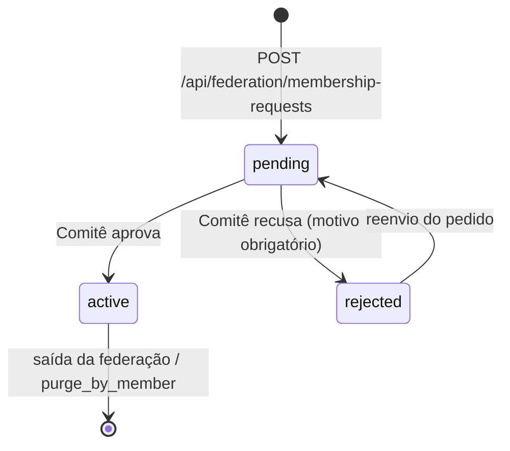

# Governança e Segurança

Este documento cobre duas frentes operacionais do Pluriverso: **governança** — como o Comitê Federado ([ADR-004/D3](https://github.com/edalcin/Arquitetura-BioCultural/blob/main/docs/tecnico/architecture-decisions/ADR-004-federated-architecture.md)) opera o protocolo de adesão ([ADR-006](https://github.com/edalcin/Arquitetura-BioCultural/blob/main/docs/tecnico/architecture-decisions/ADR-006-federation-membership-protocol.md)) através do software — e **segurança** — os controles que protegem a instância contra abuso, SSRF, injeção e vazamento de dado pessoal. O mecanismo de **autenticação** do Comitê é decidido em [ADR-003 local](decisions/ADR-003-autenticacao-do-comite.md) e não é repetido aqui; este documento assume que toda requisição às rotas do Comitê Federado (`docs/api.md` §5.2) já chegou autenticada como uma pessoa identificável (`req.committeeUser`).

---

## Governança

### Máquina de estados do pedido de adesão

O ciclo de vida de um pedido em `membership_requests` é fixado por [ADR-006/E2](https://github.com/edalcin/Arquitetura-BioCultural/blob/main/docs/tecnico/architecture-decisions/ADR-006-federation-membership-protocol.md): todo pedido nasce `pending`; só uma decisão humana do Comitê o move para `active` ou `rejected`; um pedido `rejected` pode ser reenviado pelo solicitante, voltando a `pending`; e a saída da federação (`purge_by_member`, [ADR-004/D4](https://github.com/edalcin/Arquitetura-BioCultural/blob/main/docs/tecnico/architecture-decisions/ADR-004-federated-architecture.md)) é o único caminho para fora de `active`.

Nenhuma transição é automática. Em particular, um probe técnico bem-sucedido (ver §Probe Anti-SSRF abaixo) **nunca** move `pending → active` sozinho — é sinal anexado ao pedido, não gate. A geração de `member_id` acontece uma única vez, no instante em que o Comitê aprova (`pending → active`), e esse identificador nunca é reciclado mesmo que o membro saia depois ([ADR-006/E5](https://github.com/edalcin/Arquitetura-BioCultural/blob/main/docs/tecnico/architecture-decisions/ADR-006-federation-membership-protocol.md)).

### Painel do Comitê Federado

Descrição funcional das telas — não wireframe, não é especificação visual, é o conjunto de operações que o painel precisa expor sobre os dados já modelados em `docs/modelo-de-dados.md`.

1. **Fila de pedidos de adesão.** Lista de `membership_requests`, filtrável por `status`, com o resultado do probe **visível diretamente na listagem** (indicador ok/erro, `technical_check.checked_at`) — o Comitê não precisa abrir cada pedido para saber se o endpoint do candidato respondeu. Colunas: `member_name`, `member_type`, `url_base`, `contact_email`, `created_at`, status do probe.
2. **Detalhe do pedido.** Todos os campos submetidos, o `technical_check` completo renderizado como checklist legível (item a item: esquema HTTPS, DNS/faixas bloqueadas, HTTP 200, `content-type`, presença de `member_id`/`total`/`page`/`visibility` — ver §Probe Anti-SSRF), e dois botões: **Aprovar** e **Recusar**. Recusar exige preencher `rejection_reason` antes de habilitar o envio — não existe caminho de UI para recusar sem motivo, refletindo a obrigatoriedade de `rejection_reason` quando `status='rejected'` (`docs/modelo-de-dados.md`). Aprovar dispara a geração de `member_id`, grava `decided_by`/`decided_at` e passa o membro a integrar o agendador de harvest.
3. **Fila de mapeamentos propostos.** Lista de `concept_mappings` com `status='proposed'`, exibindo lado a lado o **rótulo** (`pref_label`) do conceito de origem com o nome do membro de origem (via `source_member_id`) e o rótulo do conceito de destino com o nome do membro de destino (via `target_member_id`), mais o `predicate` proposto (`skos:exactMatch` | `skos:closeMatch` | `skos:broadMatch` | `skos:narrowMatch`). Botões **Aprovar**/**Recusar** por proposta; só `status='approved'` passa a expandir busca (`docs/busca-semantica.md`).
4. **Histórico de harvest por membro.** Lista de `harvest_runs` filtrável por `member_id`/`status`, com `mode`, `started_at`/`finished_at`, `pages_fetched`, `upserted`, `removed`, `rejected` e `error_message` quando presente — a mesma superfície que sustenta a decisão de reabilitar (`harvest_enabled=true`) um membro desativado por falhas consecutivas (`docs/contrato-harvest.md` §3).
5. **Leitura do `audit_log`.** Somente leitura, filtrável por `action`/`target_id`/`actor`, exibindo `before`/`after` quando presentes. Não existe, em nenhuma tela do painel, uma operação de edição ou exclusão sobre `audit_log` — a tabela é append-only (`docs/modelo-de-dados.md`) e o painel não pode contrariar essa garantia.
6. **Ação de purge.** Acessível a partir do detalhe de um membro ativo. Exibe primeiro um resumo do que será removido (registros, mapeamentos SKOS envolvendo o membro, conceitos, histórico de harvest) e só habilita o botão de confirmação depois que a pessoa do Comitê **digita o nome exato do membro** (`confirm_member_name`) num campo de texto — não um simples "Confirmar" genérico. Divergência entre o texto digitado e `member_name` bloqueia o envio no próprio formulário, antes mesmo de chegar ao `400` que a API também retornaria (`docs/api.md` §5.2).

**Fora de escopo, explicitamente.** O painel do Comitê **não expõe nenhuma operação que crie ou edite um registro de CTA** — nenhum formulário para inserir ou alterar espécie, uso, comunidade, relato ou qualquer conteúdo primário. O Pluriverso é middleware de federação, busca e governança semântica; aquisição de Conhecimento Tradicional Associado acontece exclusivamente nos membros (BioCultDB, BioCultRelatos, BioCultAcervos, BioCultNaturalistas), nunca no Pluriverso. A única escrita de conteúdo que o painel permite é o **cadastro manual de conceito** (`POST /api/v1/concepts`) — o fallback do harvest de conceitos quando um membro ainda não implementa `GET /api/federation/concepts` (`docs/contrato-harvest.md` §5) — e mesmo esse cadastro é vocabulário (SKOS), não um registro de CTA.

---

## Probe Anti-SSRF (ADR-006/E3)

[ADR-006/E3](https://github.com/edalcin/Arquitetura-BioCultural/blob/main/docs/tecnico/architecture-decisions/ADR-006-federation-membership-protocol.md) exige que o Pluriverso valide `{URL-BASE}/api/federation/records?page=1&size=1` antes de considerar um pedido de adesão — mas o Pluriverso está fazendo, nesse instante, uma requisição de saída para uma URL fornecida por um terceiro **ainda não confiável**. Sem validação, esse probe é uma primitiva SSRF pronta para uso: o campo `url_base` do formulário público controla para onde o servidor conecta. O algoritmo abaixo fecha essa superfície.

1. **Parse da URL.** Rejeitar qualquer esquema diferente de `https` — `error.code: PROBE_FAILED`, `failure_reason: scheme_not_https`.
2. **Rejeitar formas perigosas de autoridade.** `url_base` com userinfo (`user:pass@host`), porta diferente de `443`, ou host expresso como literal de IP (IPv4 ou IPv6, em vez de nome de domínio) é rejeitado nesta etapa — nenhuma dessas formas é necessária para uma instância de membro legítima, e todas são vetores clássicos de contorno de allowlist.
3. **Resolver DNS (A + AAAA).** **Toda** resposta de resolução precisa passar na checagem de faixa — basta **um** endereço resolvido cair numa faixa bloqueada para reprovar o probe inteiro. Um host que resolve para um endereço público e, simultaneamente, para um endereço interno (multi-homed ou registro manipulado) é tratado como inseguro por inteiro, não parcialmente.
4. **Faixas bloqueadas — lista fechada.** `0.0.0.0/8`, `10.0.0.0/8`, `100.64.0.0/10`, `127.0.0.0/8`, `169.254.0.0/16`, `172.16.0.0/12`, `192.0.0.0/24`, `192.0.2.0/24`, `192.168.0.0/16`, `198.18.0.0/15`, `224.0.0.0/4`, `240.0.0.0/4`, `::1/128`, `::/128`, `fc00::/7`, `fe80::/10`, `2001:db8::/32`, e qualquer IPv4-mapeado em IPv6 (`::ffff:0:0/96`) cujo endereço IPv4 embutido caia em alguma das faixas IPv4 acima.
5. **Conectar ao IP validado, com `Host` original.** A conexão TCP/TLS é aberta diretamente contra o endereço IP que passou nas etapas 3–4 — nunca deixando a biblioteca HTTP resolver o hostname de novo no momento da conexão — mas o header `Host`/SNI enviado continua sendo o hostname original de `url_base`. Isso fecha a janela de **DNS rebinding**: sem essa etapa, um atacante poderia responder a resolução do probe com um IP público (passa a validação) e, milissegundos depois, trocar o registro DNS para um IP interno antes da conexão de fato acontecer.
6. **`redirect: 'error'`.** Nenhum redirecionamento HTTP é seguido, em nenhuma circunstância. Redirect é o canal clássico de contorno de allowlist de URL — o candidato passaria a etapa 1–5 com uma URL pública e o redirect apontaria para um destino interno nunca validado.
7. **Limites de resposta.** Timeout total de 5 s; corpo de resposta limitado a 256 KiB — abortar a conexão assim que esse teto for excedido, sem esperar o corpo completo.
8. **Conferência de conteúdo.** HTTP `200`; `content-type: application/json`; presença de `member_id` e de `total`/`page` no envelope; e presença de `visibility` no primeiro item de `records` quando a lista vier não-vazia. Qualquer uma dessas condições ausente reprova o item correspondente do checklist, sem abortar as demais checagens já concluídas.
9. **Persistência do resultado.** O resultado completo é gravado em `membership_requests.doc.technical_check`: `{ ok, checked_at, checks: { ...um booleano por item acima... }, failure_reason, http_status, elapsed_ms }` — é esse objeto que a tela de detalhe do pedido (§Painel do Comitê Federado) renderiza como checklist.
10. **Resultado nunca decide.** Esta é uma invariante testável, não uma recomendação: nenhum caminho de código lê `technical_check.ok` para mover `pending → active` ou `pending → rejected` automaticamente. O probe só anexa sinal visível ao pedido ([ADR-006/E3](https://github.com/edalcin/Arquitetura-BioCultural/blob/main/docs/tecnico/architecture-decisions/ADR-006-federation-membership-protocol.md)) — a transição de estado é sempre uma ação humana do Comitê (§Governança acima).

### Reuso do módulo de validação no harvest

O mesmo módulo de validação de URL (etapas 1–7 acima) protege **toda requisição de harvest**, não só o probe de adesão. `url_base` é aprovado uma vez, no momento do cadastro — mas nada impede que, depois da aprovação, o DNS daquele domínio passe a resolver para um endereço interno (mudança de infraestrutura do membro, comprometimento de DNS, ou reaproveitamento futuro do domínio). Regra explícita: o `HarvestClient` valida `url_base` **a cada execução de run**, incremental ou completa, exatamente com o mesmo algoritmo do probe — a aprovação de um membro não é uma isenção permanente da checagem anti-SSRF.

---

## Demais Controles de Segurança

### Rate limiting

| Rota | Limite | Variável | Resposta ao exceder |
|---|---|---|---|
| `POST /api/federation/membership-requests` | 5/hora por IP, com teto adicional fixo de 20/dia por IP | `RATE_LIMIT_MEMBERSHIP_PER_HOUR` (default `5`) | `429` |
| `/api/v1/*` (API pública) | 60/minuto por IP | `RATE_LIMIT_PUBLIC_PER_MIN` (default `60`) | `429` |

Toda resposta `429` segue o envelope de erro de [ADR-002 local](decisions/ADR-002-api-publica-rest.md): `error.code: RATE_LIMIT_EXCEEDED`, acompanhado dos headers `X-RateLimit-Limit`, `X-RateLimit-Remaining` e `X-RateLimit-Reset`. As rotas do Comitê Federado (`docs/api.md` §5.2) não têm rate limit dedicado além da autenticação obrigatória ([ADR-003 local](decisions/ADR-003-autenticacao-do-comite.md)) — o volume de tráfego autenticado do Comitê é ínfimo comparado ao da API pública, e um limite adicional aqui seria complexidade sem consumidor real.

### Headers HTTP (helmet)

- **CSP sem `unsafe-inline` e sem CDN externo** — consequência direta de Alpine.js, HTMX, Boxicons e Tailwind serem servidos como assets locais, nunca via CDN ([ADR-001 local](decisions/ADR-001-stack-e-framework.md)); uma CSP restritiva só é sustentável porque não há script/estilo de terceiro para permitir.
- **HSTS** — reforça no navegador a exigência de HTTPS que já é pré-requisito da autenticação do Comitê ([ADR-003 local](decisions/ADR-003-autenticacao-do-comite.md)).
- **`X-Content-Type-Options: nosniff`** — impede que o navegador reinterprete o `content-type` de uma resposta.
- **`Referrer-Policy: no-referrer`** — nenhuma URL da instância (inclusive as que carregam `member_id` ou termos de busca) vaza no header `Referer` de um link de saída.
- **`frame-ancestors 'none'`** — a UI do Pluriverso nunca é embutida em `iframe` de outra origem, eliminando clickjacking sobre as ações do Comitê.

### Validação de entrada

Todo parâmetro de query e todo campo de corpo passa por **allowlist** de nome, tipo e faixa antes de chegar à camada de negócio — nenhum parâmetro desconhecido é silenciosamente ignorado ou repassado adiante. `limit` é sempre clampado a **100**, mesmo que o cliente peça mais (o default é 20, conforme `docs/api.md`). `member_type` e todo enum do sistema (`status` de pedido/mapeamento, `predicate` SKOS, `visibility`, `source_type` etc.) são validados contra a lista fechada correspondente — um valor fora da lista é `422` com `error.code: INVALID_ENUM` ([ADR-002 local](decisions/ADR-002-api-publica-rest.md)), nunca aceito e armazenado como está.

### SQL — prepared statements

Toda consulta ao SQLite usa **prepared statement com bind de parâmetro** (`better-sqlite3` suporta isso nativamente e de forma síncrona) — nunca interpolação de string no SQL, nem mesmo para valores que "parecem seguros" como um `member_id` interno gerado pelo próprio sistema. É a mesma disciplina exigida em qualquer camada que aceite entrada externa, aplicada sem exceção.

### Escape de consulta FTS5

A sintaxe de consulta do FTS5 (`NEAR`, `*`, `OR`, `AND`, `NOT`, `:coluna`) é interpretada mesmo quando o texto vem do parâmetro público `q` de `GET /api/v1/search` — isso é **injeção real, não teórica**: um usuário digitando `q=* OR *` ou `q=mandioca OR internal_field:*` altera o comportamento da busca de forma não intencional para o operador da instância, mesmo sem nenhuma vulnerabilidade de SQL injection clássica envolvida. A mitigação é escapar cada token de `q` antes de montar a expressão MATCH: envolver cada token individual em aspas duplas e duplicar qualquer aspa dupla já presente dentro do próprio token (`"` → `""`), transformando `q` inteiro numa sequência de literais de frase FTS5 — nenhuma palavra reservada do FTS5 é interpretada como operador depois desse escape, porque toda palavra chega entre aspas.

### Endurecimento do container

Container roda como usuário **não-root, uid 1001**; o diretório `/data` (onde vive `SQLITE_DB_PATH`) pertence a esse uid desde a criação da imagem. Nenhum segredo — hash de senha, string de conexão, chave — é embutido na imagem ou no repositório; tudo chega via variável de ambiente em tempo de execução (`docs/principios.md` §Segurança, `docs/operacao.md`).

### CI — Dependabot + Trivy

O pipeline de CI mantém dependências atualizadas via Dependabot e verifica a imagem publicada contra vulnerabilidades conhecidas via Trivy, conforme exigido por `docs/principios.md` §Segurança — sem isso, uma dependência desatualizada é uma superfície de ataque não monitorada.

### LGPD — dado pessoal

`contact_email`, capturado no cadastro de adesão ([ADR-006/E1](https://github.com/edalcin/Arquitetura-BioCultural/blob/main/docs/tecnico/architecture-decisions/ADR-006-federation-membership-protocol.md)), é o **único** dado pessoal armazenado pelo Pluriverso — nenhum outro campo do índice central (`records`, `concepts`, `concept_mappings`) contém dado pessoal identificável de um indivíduo; são dados de membros institucionais/coletivos e de conteúdo público já publicado por eles. Retenção: `contact_email` permanece associado ao pedido/membro enquanto a relação de federação existir, nas mesmas tabelas (`membership_requests`, `members`) e pelo mesmo prazo que os demais campos do pedido — não há coleta paralela nem cópia redundante desse e-mail em log ou tabela analítica. Via de exclusão: a saída de um membro da federação (`purge_by_member`, [ADR-004/D4](https://github.com/edalcin/Arquitetura-BioCultural/blob/main/docs/tecnico/architecture-decisions/ADR-004-federated-architecture.md)) marca o pedido como `rejected` e remove o membro de `members` (`docs/modelo-de-dados.md` §4.2) — o `contact_email` deixa de ser lido ou usado operacionalmente a partir daí; para exclusão do valor em si (e não apenas da associação ativa), o titular contata o Comitê Federado pelo canal informado no cadastro, e a atualização do campo é uma operação administrativa direta sobre o registro, fora da API pública.
